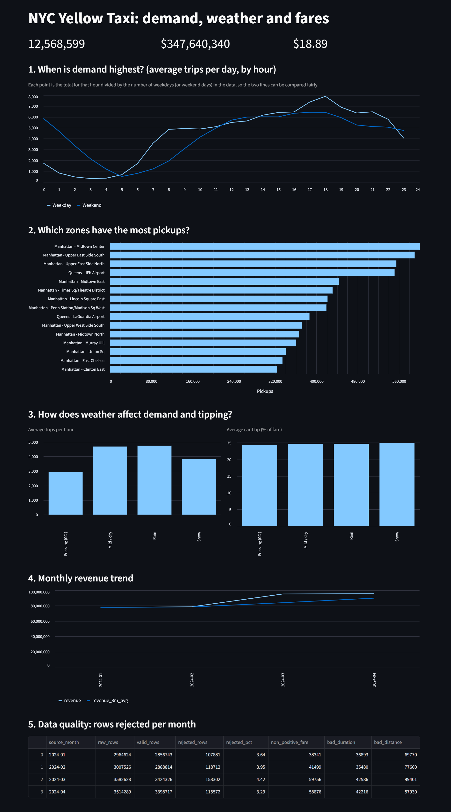
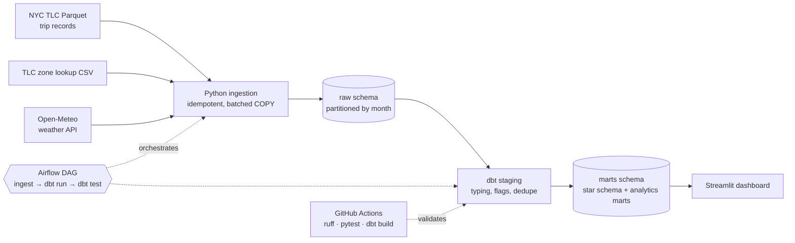
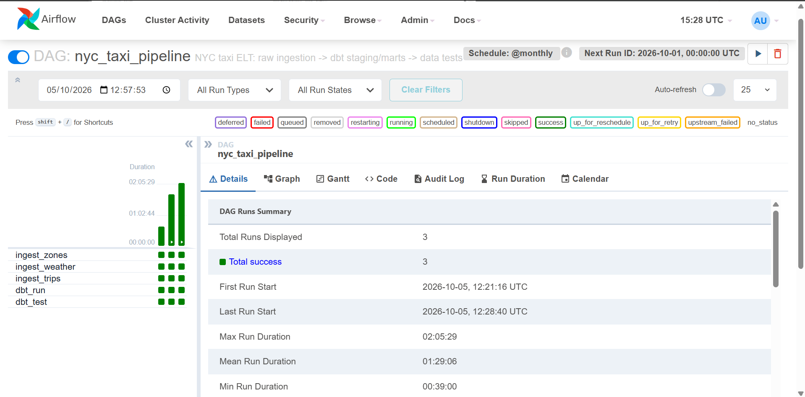

# NYC Taxi: Advanced Database & Data Engineering Pipeline


An end-to-end ELT pipeline that ingests public NYC taxi trips and weather data into PostgreSQL,
models them into a tested star schema with dbt, orchestrates everything with Airflow, and serves
insights through a Streamlit dashboard. The repo also documents the database performance work
(partitioning, indexing, materialized views) with `EXPLAIN ANALYZE` evidence.

> **Skills demonstrated:** Python ingestion · PostgreSQL (partitioning, indexing, window functions, CTEs,
> materialized views) · dimensional modelling · dbt (incremental models, tests) · Airflow ·
> Docker Compose · data quality · CI/CD (GitHub Actions) · analytics & storytelling

[Jump to: Key findings](#key-findings) · [Quick start](#quick-start) · [Performance work](#performance-work) · 
[Design decisions](#design-decisions)

## Business questions
1. When and where is taxi demand highest?
2. How do rain, snow and temperature affect demand and tipping?
3. How are fares and revenue trending month over month?
4. How much raw data is invalid, and why?

## Key findings



Based on 12.57M valid yellow-taxi trips, January to April 2024.

- **Demand peaks in the evening.** Weekdays average 7,894 trips in the 6 pm hour, the busiest
  of the day. Weekends peak at 6,425 trips in the 5 pm hour, so the weekend evening peak is about
  19% lower than the weekday peak, although weekends are far busier after midnight (see below).
  Figures are averaged per day, so weekdays are not inflated by there being more of them.
- **Late-night demand is a weekend pattern.** Between midnight and 4 am, weekends average about
  16,000 trips per day against about 3,400 on weekdays (roughly 4.8 times as many); at 2 am the gap is
  7 times (3,352 against 471). Weekend days are assigned by pickup date, so trips just after midnight
  on Saturday and Sunday are counted as weekend, which probably reflects Friday and Saturday nights out.
  This has not been tested by day of week.
- **Pickups are concentrated in a few zones.** The top five zones (Midtown Center, Upper East
  Side South, Upper East Side North, JFK Airport and Midtown East) account for about 22% of all
  trips, and four of the five are in Manhattan. JFK is the only non-Manhattan zone in the top five.
- **Cold weather had little visible effect on evening demand; rain evenings were busier in March and April.**
  Across all hours, average trips per hour were 4,687 in mild/dry weather, 4,743 in rain, 3,824 in snow
  and 2,923 in freezing hours (-38%). Most of that raw gap is not weather: 40% of freezing hours fall
  between midnight and 6 am (about 21% for mild hours), and all freezing evenings are in January and
  February, when demand was lower overall. Comparing only 5-8 pm hours within the same month, freezing
  hours averaged 6,377 trips against about 6,515 for mild hours (-2%, 28 hours), and snow was about +2%
  (8 hours, all in January). Rain evenings were busier than mild evenings in March (+14%, 20 hours) and
  April (+27%, 14 hours) but not in January or February (+1% to +2%, 14 hours). These cover 21 rain evenings,
  16 of them weekdays (about 76%, against 72% of all days), so weekday mix does not explain the March result;
  April is probably somewhat inflated because all six of its rain evenings were weekdays. The effect is also
  uneven: weekday rain evenings in March and April ranged from about 6,400 to 10,350 trips, with six above
  9,200 driving most of the average. The sample is small and hours within an evening are not independent,
  so this is a lead rather than a conclusion. Card tips stayed at about 24-25% of the fare in every category,
  so weather made no visible difference to tipping.
- **Revenue grew from winter into spring.** Monthly revenue was $78.0M in January and $78.6M in
  February, then $95.3M in March and $95.7M in April. Part of the 21% February-to-March jump is the
  calendar (31 days against 29). Per day, revenue rose about 13% and trips rose about 11%
  (99,614 to 110,462). The rise was broad-based: both weekdays (+11.5%) and weekends (+9.9%) grew,
  airports added the most trips per day (JFK +651, LaGuardia +443), and the increase started around
  the end of February. This fits a seasonal pickup, but one year of data cannot separate seasonality
  from a one-off effect. Average temperature also rose from 2.1 °C in February to 7.0 °C in March, but
  within each month day-to-day temperature showed no relationship with weekday trips
  (correlation -0.01 over 87 days), so weather alone does not appear to explain the increase.
- **About 3.8% of raw rows were rejected as invalid.** Rejection stayed between 3.3% and 4.4% each
  month. Bad distances were the largest single cause in January to March (about level with zero or
  negative fares in April), and about 86% of them were trips recorded as exactly 0 miles (261,577 trips);
  only 291 were over 200 miles. About 94% of the zero-mile trips had a positive fare (average $25.59),
  so the rule also discards some trips that look real. Durations outside 1-360 minutes were also common.
  A trip can break several rules, so these counts overlap. A tip-outlier test also caught 620 January
  trips with tips above 200% of the fare, which led to a new validation rule.

**Caveats:** this is four months of data, so the seasonal findings are indicative only. Weather
comes from a single point for all of NYC. "Freezing" means freezing and dry; rain and snow hours are classed 
separately whatever the temperature. Freezing hours are concentrated overnight and in the colder, quieter months, 
so the raw drop mostly reflects time of day and season rather than the cold (see above). Snow covers only 81 hours. 
The analysis shows association, not cause.

The queries behind every number are in [sql/analysis](sql/analysis).

### Investigation: what drove the March increase?

Trips per day rose about 11% from February to March 2024. What I checked, and what it showed:

| Check | Finding |
|---|---|
| Per-day normalisation | Revenue is up 21% month on month but about 13% per day; March has 31 days against 29 |
| Weekday vs weekend | Both grew (weekdays +11.5%, weekends +9.9%) |
| Zones | Broad-based; the 10 zones that added the most trips account for only about a third of the increase. JFK (+651 per day) and LaGuardia (+443) added the most |
| Timing | Weekly trips were flat through February, then stepped up in the week starting 26 February (which includes the first days of March) |
| Trip mix | Slightly longer trips (+4% distance, +5% duration); passengers unchanged |
| Weather | Warmer in March, but no day-to-day relationship with trips (correlation -0.01) |

**Conclusion:** the increase is broad, began around the end of February and is not explained by weather
alone. It is consistent with a seasonal pickup, but with a single year I cannot separate
seasonality from a one-off effect. Loading the same months from 2023 would be the next test of the seasonal explanation.

## Business insights and recommendations

What the findings suggest for a taxi operator or fleet manager. These are hypotheses to test,
not proven causes (four months, one city, one weather point).

| Insight | Evidence | Suggested action |
|---|---|---|
| Demand is highest on weekday evenings | Weekdays average 7,894 trips in the 6 pm hour; weekends peak at 6,425 at 5 pm | Schedule the largest share of driver shifts for 5-7 pm on weekdays, and keep a smaller, earlier peak in mind for weekends |
| Late-night demand is mainly a weekend pattern | Midnight to 4 am averages about 16,000 trips per day on weekends against about 3,400 on weekdays | Test by day of week first; if the late-night peak is concentrated on Friday and Saturday nights, staff for those nights and keep a minimal fleet on weeknights |
| Demand is concentrated in a few zones | The top 5 zones make up about 22% of all trips; 4 of 5 are in Manhattan, and JFK is the only exception | Position vehicles and dispatch effort around Midtown, the Upper East Side and JFK first |
| Cold weather showed little effect once time of day and month are matched; rain evenings may be busier | Across all hours freezing was -38% against mild, but 40% of freezing hours are overnight and all are in January and February. In same-month 5-8 pm hours, freezing was about -2% (28 hours) and snow about +2% (8 hours). Rain was +14% in March and +27% in April (15 evenings) but only +1% to +2% in January and February (6 evenings), and the spring effect is driven by a handful of evenings | Do not cut supply for cold weather on this evidence. Treat the rain effect as a hypothesis and test it on more months (for example 2023) before adding rain-day capacity |
| Revenue growth is mostly more trips, not higher fares | Trips per day rose about 11% from February to March (99,600 to 110,500) while the average fare rose about 4% ($18.39 to $19.13) | Treat volume as the main revenue driver and check what drove the March increase before forecasting from it |
| About 3.8% of reported trips are invalid | 500k of 13.1M raw rows rejected; mostly zero-distance trips, plus zero or negative fares and impossible durations | Validate fare, distance and trip duration at the point of recording, so revenue figures are not distorted by bad records |

**Next questions worth testing:** average fare by zone (is JFK more valuable per trip?), whether the rain effect holds on weekdays only and across more months (including 2023), and whether the March jump repeats in other years.

## Architecture



Layers: **raw** (as loaded + lineage columns) → **staging** (typed views, validity flag) →
**marts** (`fact_trips`, `dim_*`, analytics marts). ERD: [docs/erd.md](docs/erd.md) ·
Data dictionary: [docs/data_dictionary.md](docs/data_dictionary.md).

Orchestration: the Airflow DAG runs ingest, then `dbt run`, then `dbt test`. Runs complete in roughly 40 minutes to 2 hours on an 8 GB laptop.



## Quick start

Requirements: Docker Desktop, about 8 GB RAM (16 GB is more comfortable) and a few GB of free disk space. The first month
takes a while to download and load.

```bash
git clone https://github.com/boakyedwamena-alt/nyc-taxi-data-pipeline.git
cd nyc-taxi-data-pipeline
make up                         # Postgres + Airflow + dashboard
make pipeline MONTH=2024-01     # ingest -> dbt run -> dbt test
```

No `.env` file is needed: the Docker setup has working defaults. Copy `.env.example` to `.env` only if you want to change
the database credentials.

**On Windows without `make`**, run these instead:

```bash
docker compose up -d --build
docker compose exec -T airflow python -m ingestion.ingest --month 2024-01
docker compose exec -T airflow bash -c "cd /opt/airflow/dbt_project && /opt/dbt_venv/bin/dbt run --profiles-dir ."
docker compose exec -T airflow bash -c "cd /opt/airflow/dbt_project && /opt/dbt_venv/bin/dbt test --profiles-dir ."
```

Once the containers have started, open these addresses **on your own machine** (they only work
while the project is running locally in Docker, because `localhost` means your own computer):

| Service | Address | Login |
|---|---|---|
| Dashboard | `http://localhost:8501` | none |
| Airflow | `http://localhost:8080` | admin / admin |
| Postgres | `localhost:5432` | taxi / taxi |

**Not running it yourself?** The dashboard and Airflow screenshots in this README show the
pipeline working: [dashboard](docs/dashboard.png) and [Airflow runs](docs/airflow_dag.png).

Load more months for richer trends: `make ingest MONTH=2024-02`, then `make dbt-run dbt-test`.
Or trigger the DAG for a given month from your terminal:

```bash
docker compose exec -T airflow bash -c "airflow dags trigger nyc_taxi_pipeline --conf '{\"month\": \"2024-02\"}'"
```

## Design decisions
- **Idempotent loads:** each month is a Postgres list partition; reloading truncates only that
  partition inside one transaction, so reruns never duplicate rows and failures roll back cleanly.
- **Fast ingestion:** the Parquet file is streamed in batches and loaded with `COPY`, not row inserts.
- **Auditable cleaning:** invalid trips are *flagged* in staging and counted in `mart_data_quality`
  instead of silently dropped.
- **Cost of the validity rules:** trips with 0 miles but a positive fare (about 245,000, average
  fare $25.59, roughly $6M in fares) are excluded as invalid. This is deliberately conservative, so
  revenue totals are probably understated by the order of 2%. Rejections are audited in
  `mart_data_quality` so the effect stays visible.
- **Incremental fact table:** `fact_trips` uses dbt `delete+insert` on `trip_id` and reprocesses only the
  latest loaded month onward. Limitation: after loading an *earlier* month, run `dbt run --full-refresh`
  so it reaches the fact table.
- **Weather source:** Open-Meteo (no API key needed) in NYC local time to match TLC timestamps.
  Note: one weather point for the whole city is an approximation.
- **Airflow scheduling:** switching the DAG on makes Airflow run the latest scheduled month (two
  months behind today). Pause the DAG, or trigger it manually with a month, if you only want 2024.

## Data quality
dbt tests: unique / not-null keys, accepted values, referential integrity (fact → every dimension) and
custom tests (no non-positive fares, dropoff after pickup, tip outlier guard). Run: `make dbt-test`. 
CI runs `dbt build` against an empty database to validate the SQL, model dependencies and test definitions; 
the data tests run against the loaded data with `make dbt-test`.

## Performance work

Measured on an 8 GB Windows laptop with 12.5M trip rows (single runs; the baseline ran first, so it includes cold-cache effects and the speedups are indicative, not exact).
Full queries and caveats: [sql/performance](sql/performance) and [docs/benchmarks.md](docs/benchmarks.md).

| Technique | Query | Before | After |
|---|---|---|---|
| B-tree index | Pickups by zone, one day | 16,446 ms (cold) | 237 ms (about 69x faster) |
| BRIN index | Same query | 16,446 ms | 771 ms (21x faster) |
| Month partitioning | Trips by zone, one month | 3,961 ms (plain table) | 2,046 ms (1.9x faster) |
| Materialized view | Daily KPIs, one day | 1,682 ms | 0.18 ms |

## Repo layout
```
ingestion/        Python loaders (trips, zones, weather)
airflow/          Dockerfile + DAG
dbt_project/      staging, marts, macros, tests
sql/init/         DDL run on first container start
sql/performance/  partitioning / indexing / matview experiments
sql/analysis/     queries behind the Key findings and the March investigation
dashboard/        Streamlit app
docs/             ERD, data dictionary, benchmarks
tests/            pytest unit tests
.github/          CI workflow
```

## Development
```bash
python -m venv .venv
source .venv/bin/activate        # Windows: .venv\Scripts\activate
pip install -r requirements-dev.txt
ruff check . && pytest -q
```

## Possible extensions
Same months from 2023 (to test seasonality), green taxi / FHV data, dbt snapshots, Great Expectations, a cloud warehouse port (BigQuery / Snowflake), dbt docs on GitHub Pages.

Data: NYC TLC Trip Record Data and Open-Meteo (see their terms). Licence: MIT.
