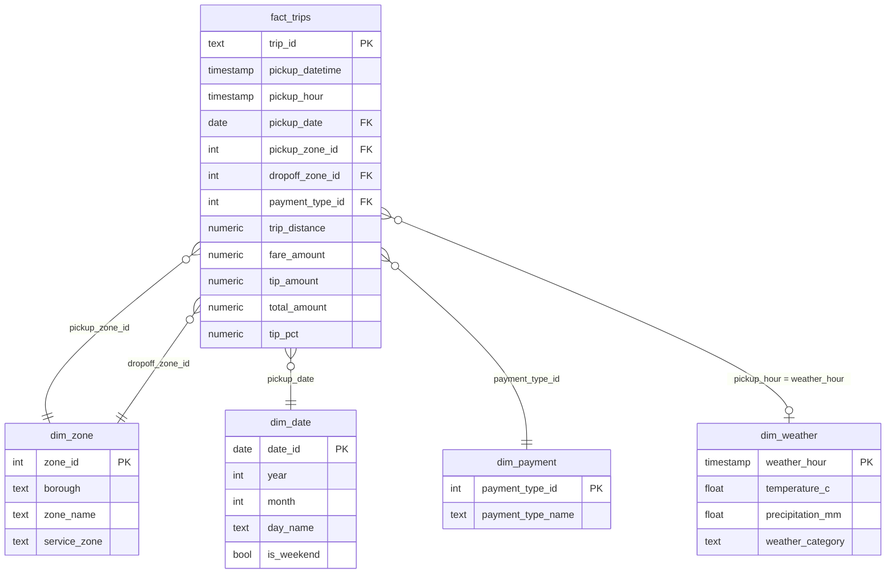

# Entity relationship diagram (star schema)

```mermaid
erDiagram
    fact_trips }o--|| dim_zone : "pickup_zone_id"
    fact_trips }o--|| dim_zone : "dropoff_zone_id"
    fact_trips }o--|| dim_date : "pickup_date"
    fact_trips }o--|| dim_payment : "payment_type_id"
    fact_trips }o--o| dim_weather : "pickup_hour = weather_hour"

    fact_trips {
        text trip_id PK
        timestamp pickup_datetime
        timestamp pickup_hour
        date pickup_date FK
        int pickup_zone_id FK
        int dropoff_zone_id FK
        int payment_type_id FK
        numeric trip_distance
        numeric fare_amount
        numeric tip_amount
        numeric total_amount
        numeric tip_pct
    }
    dim_zone { int zone_id PK  text borough  text zone_name  text service_zone }
    dim_date { date date_id PK  int year  int month  text day_name  bool is_weekend }
    dim_payment { int payment_type_id PK  text payment_type_name }
    dim_weather { timestamp weather_hour PK  float temperature_c  float precipitation_mm  text weather_category }
```
